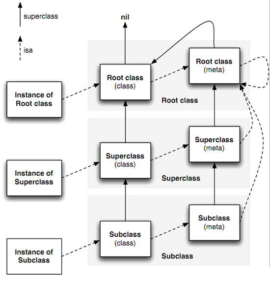

数据结构

类对象 元类对象

消息传递

方法缓存


1.1 isa_t

```c
union isa_t  {
    Class cls;
    uintptr_t bits;
    ...
};
```

isa 本质是一个 联合体；

在64位架构下，isa 指针是64位的；

isa 有2种类型：   
指针型isa: isa 的值代表Class的地址；   
非指针型isa: isa 的值部分代表Class的地址；多出来的位可以存储其他内容；
 
isa 的作用：isa 就是用来指向的，和 superclass 构成了一张关系网； 

isa 指向图 :




1.2 objc_object

```c
typedef struct objc_object *id;

struct objc_object {
    isa_t isa;
    // 关于 isa 操作相关
    // 关联对象相关
    bool hasAssociatedObjects();
    void setHasAssociatedObjects();
    // 弱引用相关
    bool isWeaklyReferenced();
    void setWeaklyReferenced_nolock();
    // 内存管理相关
    id retain();
    void release();
    id autorelease();
    ...
};
```

1.3 objc_class

```c
typedef struct objc_class *Class;

struct objc_class : objc_object {
    Class superclass;
    cache_t cache;             // formerly cache pointer and vtable
    class_data_bits_t bits;    // class_rw_t * plus custom rr/alloc flags
    ...
};
```

1.4 cache_t

```c

struct cache_t {
    // 存储被缓存方法的哈希表
    struct bucket_t *_buckets;
    // 占用的总大小
    mask_t _mask;
    // 已使用大小
    mask_t _occupied;
};

struct bucket_t {
    cache_key_t _key;
    IMP _imp;
};
```

cache_t : 可增量扩展的哈希表结构；

哈希表是为了提高效率；
可增量扩展 会扩大容量，容纳更多的缓存；

1.5 

```c

struct class_data_bits_t {
    // Values are the FAST_ flags above.
    uintptr_t bits;
};

```

class_data_bits_t 是对 class_rw_t 的封装；

class_rw_t 代表了类相关的读写信息，对 class_ro_t 的封装；


