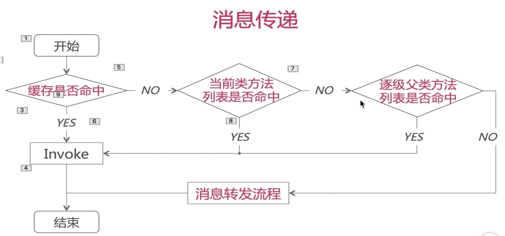
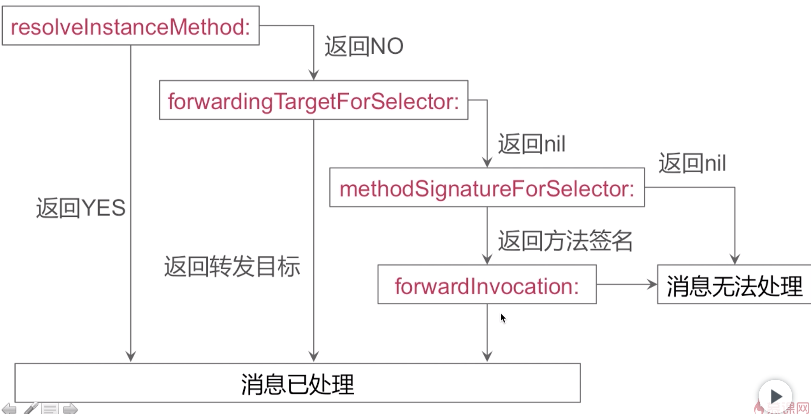

#### 消息发送及消息转发

1. 方法调用

方法调用的本质是 消息发送，核心方法是 `id objc_msgSend(id self, SEL op, ...)` ;

此方法有2个固定参数：   
参数1是个对象，即消息接收者；   
参数2是方法名；   

流程： 同 self.isa 找到对应类，及方法列表中的方法，然后调用；

?? 问题1 : 以下2种调用的机制

```
class Tester :
- (instancetype)init {
// 这里其实最终调用的是 NSObject init 方法
// NSObject 实现了 init 方法
// super 只是让寻找此方法的起点从父类开始
    self = [super init]; 
    if (self) {
        NSLog(@"self class ........ %@", [self class]);   // Tester
        NSLog(@"super class ........ %@", [super class]); // Tester
    }
    return self;
}

```

`[self class] = objc_msgSend(self, sel_registerName("class"));`

先从 Tester 这个类开始找，然后到父类中找，一层一层向上找之后，在 NSObject 的类中发现这个class方法，而 NSObject 的这个class方法，就是返回 receiver 的类别，所以这里输出 Tester ;


`[super class] = objc_msgSendSuper({self, class_getSuperclass(objc_getClass("Tester"))}, sel_registerName("class"));
`

而当方法中的super关键字接收到消息时，编译器会创建一个objc_super结构体: `struct objc_super { id receiver; Class class; };` ;  
然后先去 superClass 中去找，一层一层向上找之后，结果还是在NSObject中找到了。然后内部使用函数`objc_msgSend(objc_super->receiver, @selector(class))` 去调用，此时已经和[self class]调用时相同了 ;

> NSObject class() 方法的独特之处就是它返回的是 此方法的真正调用者； 
>   
> super 只是编译器的特殊字符，并不代表父类的一个实例化对象，它的作用就是让寻找方法的起点从父类开始，而不是本类；


2. 消息传递机制



流程介绍：

1.1 检查 selector 是不是应该被忽略；  
1.2 检测 target 是不是 nil，如果是 nil 也会被忽略；   
1.3 查找缓存列表；  
1.4 查找方法列表；   
1.5 如果存在父类，则去父类缓存列表查找，然后父类方法列表；  
1.6 如果都没有，则走消息转发流程；  

注意点：

1.1  缓存查找的方式   
缓存查找就是通过 SEL 找到对应的 IMP;   
缓存查找的方式是 哈希查找，通过 SEL 和 哈希算法 算法对应IMP的索引位置；   
哈希查找就是提高查找效率；

1.2 在当前类方法列表中查找  
对于有序列表，采用二分查找；  
对于无序列表，采用一般遍历的方式查找；  

> 注意： 不光是查找流程，还要查找的方式；


3. 消息转发流程



第一步: 通过 runtime 动态的给对应的类添加一个方法实现，来响应这个 selector；

第二步: 快速消息转发，返回一个新的对象，对这个对象发送 selector 消息；

第三步: 相当于一个消息分发中心，将无法识别的消息转发给其他对象；

`- (NSMethodSignature *)methodSignatureForSelector:(SEL)selector`

NSMethodSignature 是对 selector 返回值的类型，参数个数及类型的封装，就是 type encodings；

NSInvocation 对象封装了 原始消息和对应的参数；

?? 问题2 : 第二步和第三步有什么区别


应用： 
处理一些调用未知的API，防止崩溃；  
例如： 在老版本中调用了新版本的API，会导致奔溃；


